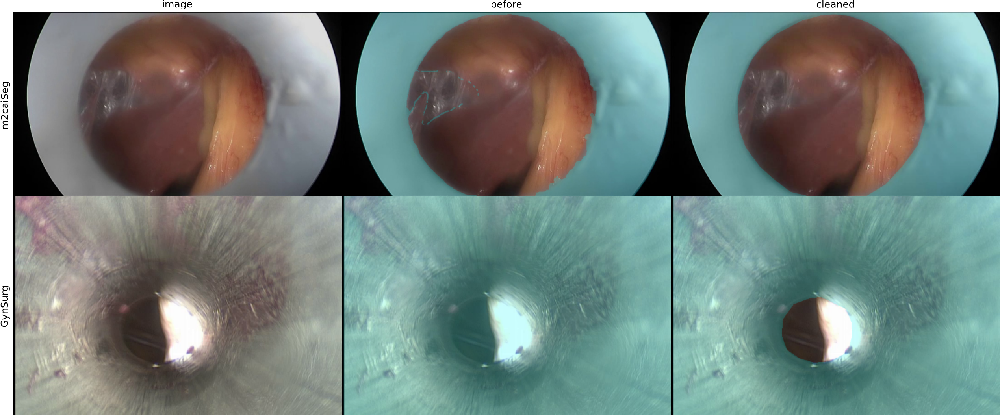
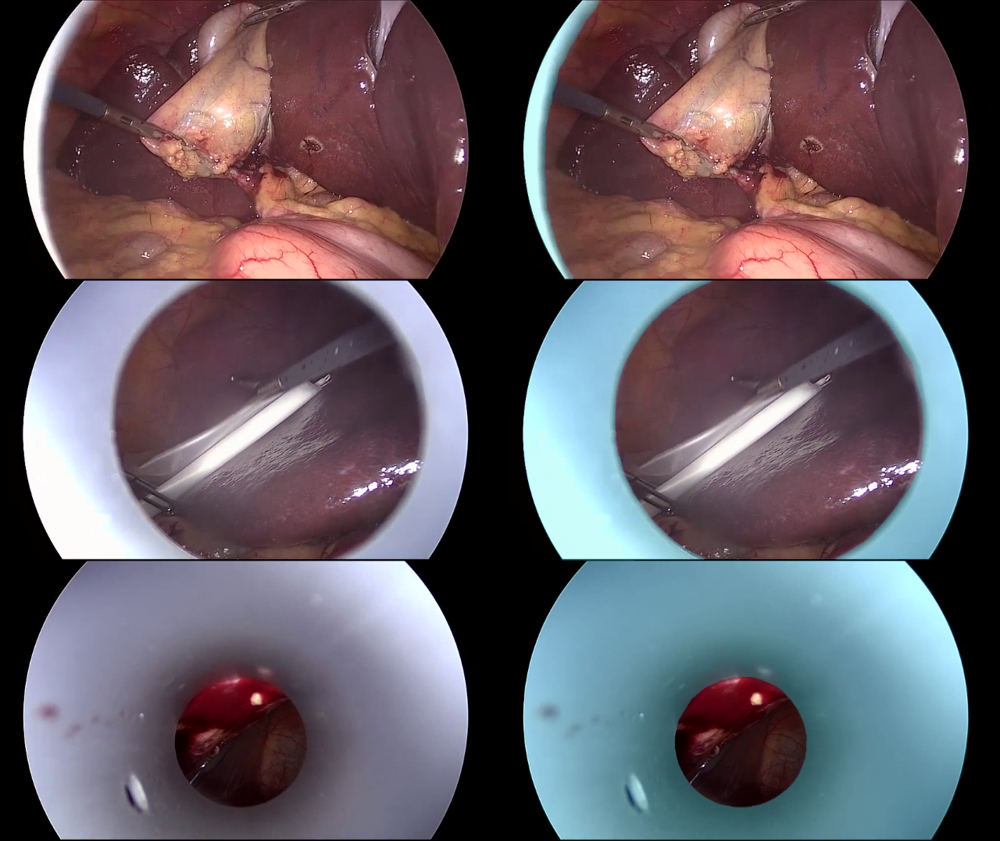

# Cholec80-port: A Geometrically Consistent Trocar Port Segmentation Dataset for Robust Surgical Scene Understanding

**Cholec80-port** is a new, high-fidelity port segmentation dataset derived from the Cholec80 dataset. It addresses the limitations of existing datasets (m2caiSeg and GynSurg) by establishing a rigorous Standard Operating Procedure (SOP) for annotation that prioritizes geometric fidelity. This dataset is critical for tasks such as Visual SLAM (vSLAM), image stitching, and 3D reconstruction in laparoscopic surgery.


*Figure 1. Examples of erroneous (m2caiSeg: top, GynSurg: middle) and cleaned annotations. Original frames are on the left, with corresponding blue overlays on the cetner and right.*

## Dataset Comparison

| | m2caiSeg | GynSurg | **Ours (Cholec80-port)** |
| :--- | :--- | :--- | :--- |
| **Data Source** | MICCAI 2016 Surgical Tool Detection dataset | Original | Cholec80 |
| **Class Name** | trocars | in-cannula, cannula | port sleeve |
| **Total Videos** | 15 (10 train, 5 test) | 10 | 20 (8 train, 2 val, 10 test) |
| **Total Frames** | 369 | 4873 | 38434 |
| **# Annotation for Ports** | 255 | 130 | 1398 |
| **Hole Policy** | excluded (can be filled) | filled | excluded (can be filled) |
| **Resolution** | 596x334 - 774x434 | 720x480 | 854x480 |
| **Video Availability** | no | no | yes |


*Example of Cholec80-port annotation.*

## Results

### Before Cleaning (Original Datasets)

| Trained Data | m2caiSeg (test, cleaned) <br> Dice / F1 | GynSurg (VIDEO09, 10) <br> Dice / F1 | Ours (video11-20) <br> Dice / F1 |
| :--- | :--- | :--- | :--- |
| **m2caiSeg (trainval)** | 0.0203 / 0.0588 | 0.0091 / 0.0263 | 0.2128 / 0.2949 |
| **GynSurg (VIDEO01-08)** | 0.0031 / 0.0588 | 0.6651 / 0.8484 | 0.1090 / 0.5638 |
| **Ours (video01-video08)** | 0.0296 / 0.0588 | 0.3546 / 0.5714 | 0.8616 / 0.8556 |

### After Cleaning (Proposed Method)

| Trained Data | m2caiSeg (test) <br> Dice / F1 | GynSurg (VIDEO09, 10) <br> Dice / F1 | Ours (test) <br> Dice / F1 |
| :--- | :--- | :--- | :--- |
| **m2caiSeg (train)** | 0.4477 / 0.6667 | 0.0029 / 0.0294 | 0.2485 / 0.2949 |
| **GynSurg (VIDEO01-08)** | 0.3274 / 0.6667 | 0.8800 / 0.8529 | 0.3258 / 0.6053 |
| **Ours (train)** | 0.4876 / 0.6667 | 0.6110 / 0.5588 | 0.8616 / 0.8556 |
| **Combined (All Cleaned)** | **0.7218** / **1.0000** | 0.8185 / 0.8235 | 0.8127 / 0.8698 |

*Note: Dice = Dice Score (GT>0), F1 = Detect F1 Score.*

# How to use
## 0. Environment Setup
```bash
uv venv
uv sync
source .venv/bin/activate
```

## 1. Download our dataset 
Download our dataset and cleaned annotations from: https://www.kaggle.com/datasets/shunsukekikuchi/cholec80-port
```bash
kaggle datasets download shunsukekikuchi/cholec80-port
unzip cholec80-port.zip
```

## 2. Download Original dataset and preprocessing
#### Cholec80-port
Please download cholec80 here: https://camma.unistra.fr/datasets/
```bash
tar -xvzf cholec80.tar.gz
python cholec80-port/cholec80_frame_sample.py --cholec80-dir PATH_TO_CHOLEC80_DATASET (default: cholec80)
```

#### GynSurg - cleansed
Please Download Gynsurg Auxiliary Tool Dataset here: https://ftp.itec.aau.at/datasets/GynSurge/
```bash
unzip GynSurg_Auxiliary_Tool_Dataset.zip
python GynSurg_cleaned/create_hole.py
cp -r GynSurg_Auxiliary_Tool_Dataset/tool GynSurg_cleaned/input
rsync -av --ignore-existing GynSurg_Auxiliary_Tool_Dataset/tool_mask/ GynSurg_cleaned/new_mask/
```

#### m2caiSeg_cleaned
Please Donwload m2caiSeg Dataset here: https://www.kaggle.com/datasets/salmanmaq/m2caiseg
```bash
unzip m2caiseg.zip
cp -r 'm2caiSeg dataset/test/images' m2caiSeg_cleaned/test_new/images
cp -r 'm2caiSeg dataset/train/images' m2caiSeg_cleaned/train_new/images
```

## 3. Training

#### Cholec80-port
```bash
cd cholec80-port-src
python train_unet.py
```

#### GynSurg
```bash
cd GynSurg
python train_unet.py
```

#### m2caiSeg_cleaned
```bash
cd m2caiSeg
python train_unet.py
```

## 4. Evaluation
```bash
cd cholec80-port-src
python eval_semseg_models.py
cd GynSurg
python eval_semseg_models.py
cd m2caiSeg
python eval_semseg_models.py
```


# Pretrained weights
you can use our pre-trained, open-source port segmentation model by the following:
```bash
# download weights
wget https://github.com/JmeesInc/cholec80-port/releases/download/v1.0.0/convnext_base-unet-allport.pt
wget https://github.com/JmeesInc/cholec80-port/releases/download/v1.0.0/convnext_base-unet-cholec80_port.pt
```
```python
# define model and load weight
import torch
import segmentation_models_pytorch as smp
model = smp.Unet("tu-convnext_base")
weights = torch.load("convnext_base-unet-cholec80_port.pt")
model.load_state_dict(weights)

with torch.inference_mode():
    output = model(image).sigmoid()
```


# Acknowledgement
Thanks to these great repositories: [segmentation-models-pytorch](https://github.com/qubvel-org/segmentation_models.pytorch), [GynSurg](https://github.com/Sahar-Nasiri/GynSurg)


# License
This project is under CC BY-NC 4.0. See the [LICENSE](./LICENSE.txt) file for details about the license under which this code is made available.
